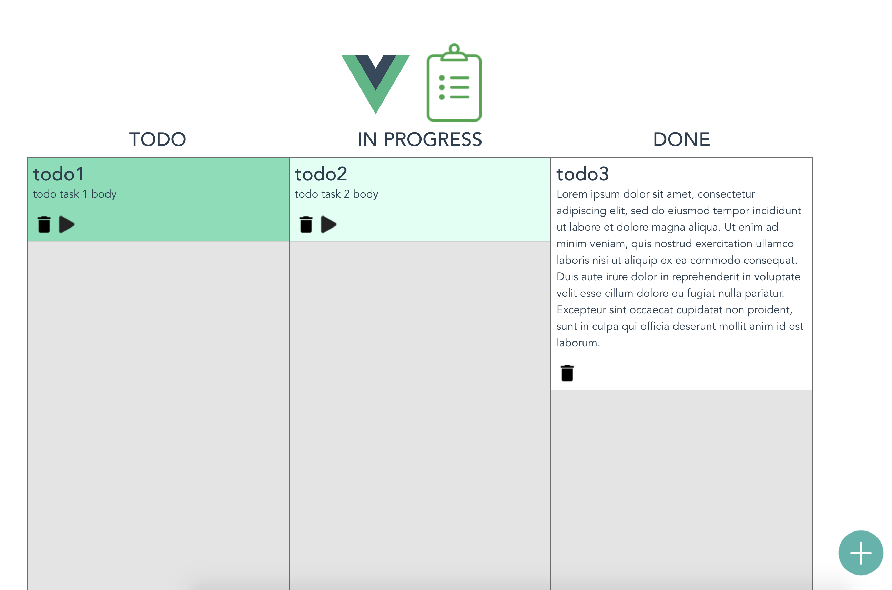
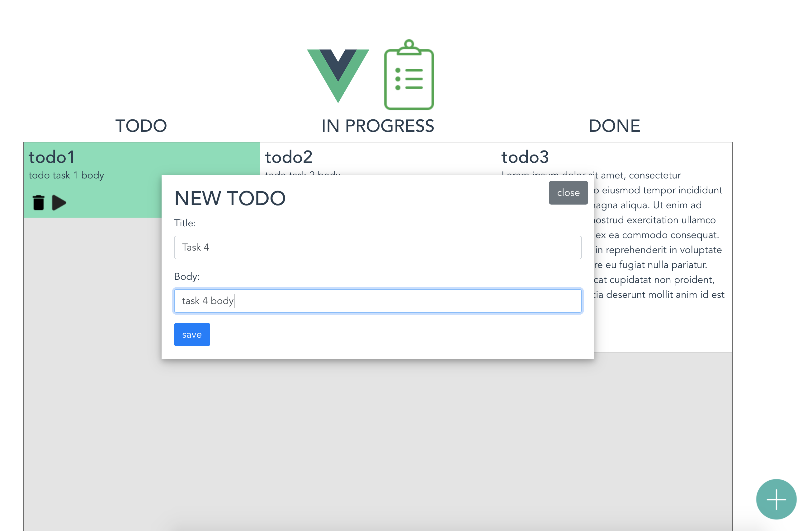

**ATTENTION! This project is no more maintained.**

# vue-todo

Example of Todo list application made with Vue.JS.
This project was made with the intent of exploring the Vue.js framework and to have fun.

## Features
 - Create new Task with a Title and a Description.
 - move the task to different states using Drag and Drop.
 - Delete a task

